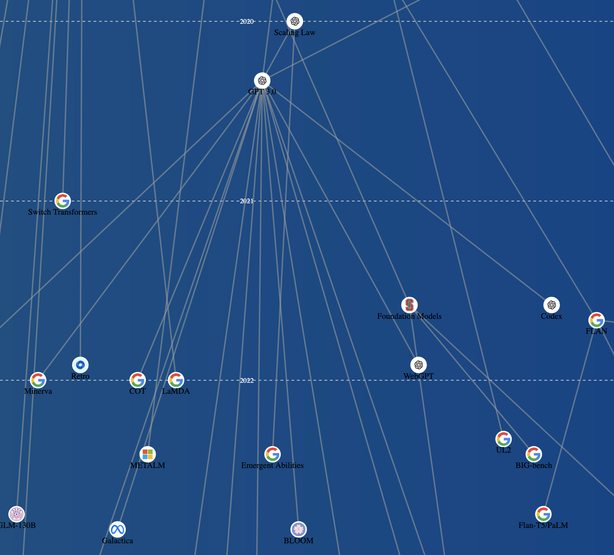

# LLM Tree

[](https://opensource.org/licenses/MIT)

An interactive visualization of Large Language Model (LLM) development timelines using Directed Acyclic Graph (DAG) representation.



## Implementation Details

### Core Technologies
- **D3.js** (v7) - Graph rendering and force simulation
- **SVG** - Vector graphics rendering
- **Modern JavaScript** (ES6+) - Interactive functionality
- **CSS3** - Animations and styling

### Architecture
```plaintext
project-root/
├── public/
│   ├── api/
│   │   └── graph.json        # LLM node data
│   ├── assets/               # Images/icons
│   ├── script.js             # Main application logic
│   └── index.html            # Main entry point
```
### Key Components

##   Data Structure

        Nodes with temporal, organizational, and technical metadata

        Parent-child relationships for model evolution

        Auto-calculated text widths for collision prevention

##  Visualization Engine

        Force simulation with multiple constraints:

            Temporal y-axis positioning

            Collision detection

            Parent-child spacing

        Dynamic scaling during zoom operations

##  UI Components

        Animated gradient background

        Context-preserving year grid lines

        Resizable node details panels

        Persistent informational overlays

### Installation & Usage
## Prerequisites

    Modern web browser (Chrome/Firefox/Safari)

    Node

## Quick Start

    Clone the repository:
    git clone https://github.com/josh-janes/llm-tree.git
    cd llm-evolution-tree

    npm install
    npx serve

    http://localhost:3000

### Data API

The graph expects a JSON endpoint at /api/graph with following structure:
```json
{
  "nodes": [
    {
      "id": "model-id",
      "name": "Model Name",
      "date": "YYYY-MM-DD",
      "link": "arxiv-url",
      "image": "image-url",
      "properties": {
        "organization": "Developer",
        "type": "Architecture"
      }
    }
  ],
  "links": [
    {"source": "parent-id", "target": "child-id"}
  ]
}
```


### Contributing

    Fork the repository

    Create feature branch (git checkout -b feature/improvement)

    Commit changes (git commit -am 'Add new feature')

    Push to branch (git push origin feature/improvement)

    Open Pull Request

### Acknowledgments

    D3.js visualization library

    Font Awesome icons

    arXiv.org for research paper metadata
